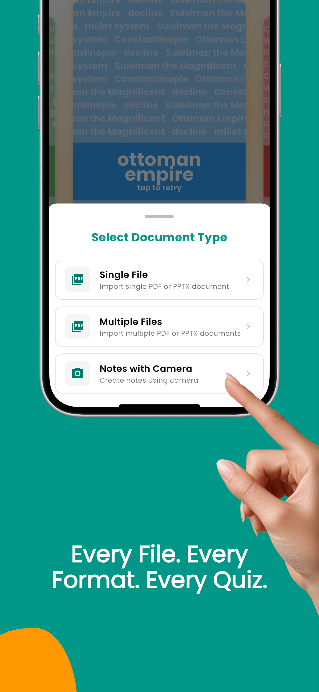
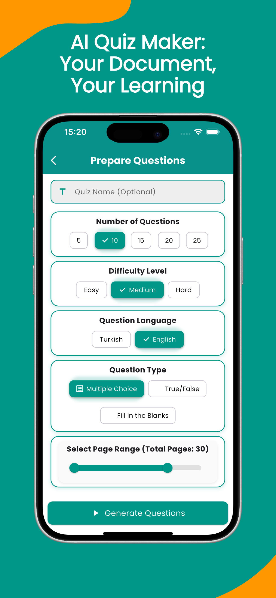
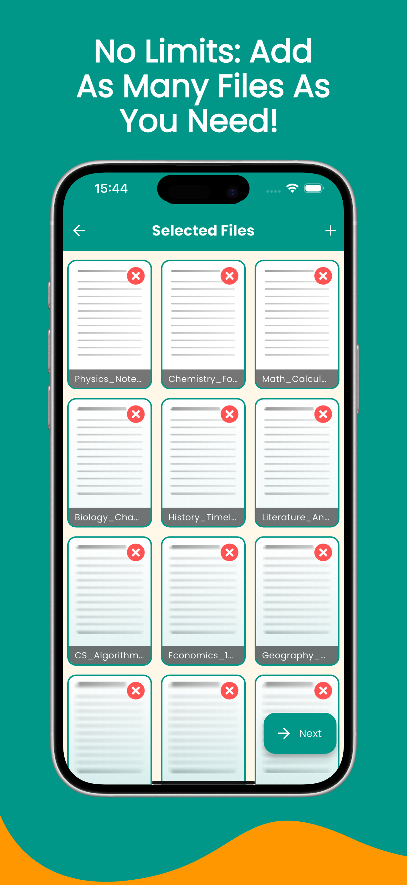
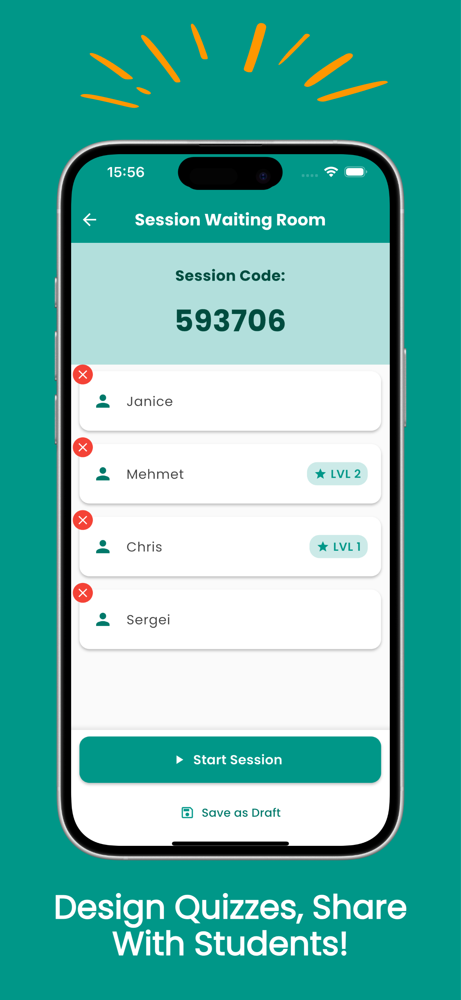
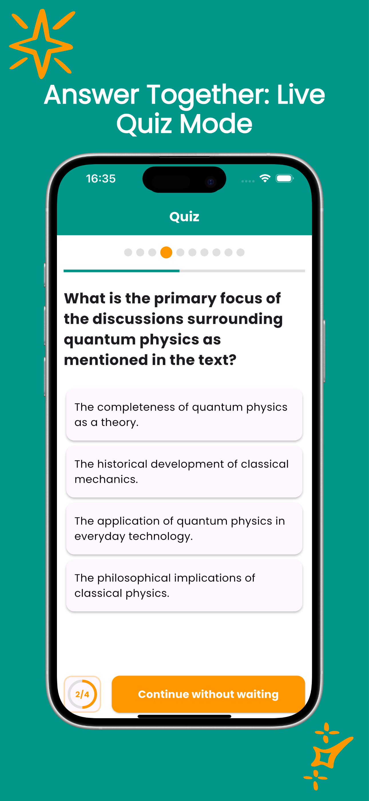
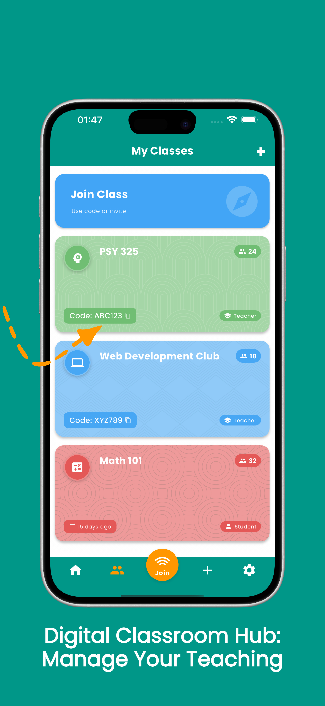
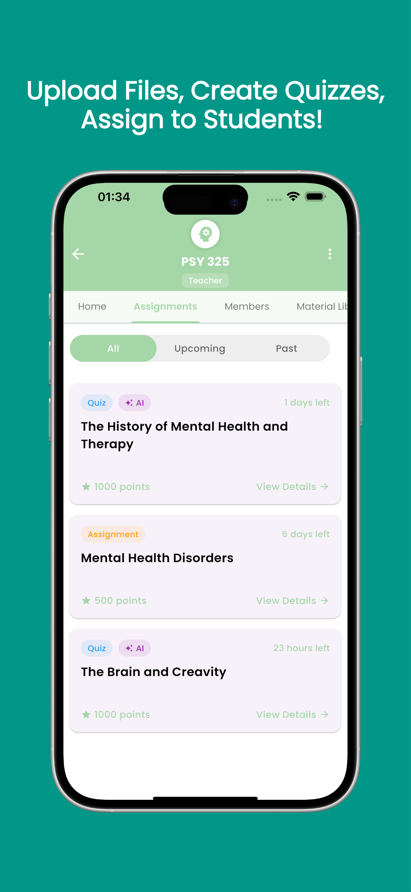

# EduQuest: AI-Powered PDF to Quiz Transformation

  
   
   
  

## 🚀 Your Personal Learning Assistant

EduQuest revolutionizes how you interact with your study materials. Whether you're a student preparing for exams, a teacher creating engaging assessments, or a lifelong learner expanding your knowledge, EduQuest provides powerful tools to transform passive reading into active learning through AI-generated quizzes.

## ✨ Key Features

### 📚 EduQuest Mode
- **Unlimited Document Support**: Upload any number of PDF or PowerPoint files
- **AI-Powered Question Generation**: Transform documents into customized quizzes in seconds
- **Full Customization**:
  - Choose question types (multiple choice, true/false)
  - Set difficulty levels
  - Select specific page ranges
  - Generate questions in multiple languages
- **Performance Tracking**: Review your results and track progress

### 🏆 EduChallenge Mode
- **Live Interactive Quizzes**: Create Kahoot-style competitive quiz sessions
- **Web Access for Participants**: Others can join via the web without downloading the app
- **Enhanced Engagement**: Add images to questions for more dynamic quizzes
- **Real-time Competition**: Engage with friends or classmates in live quiz battles

### 👨‍🏫 Classes Mode
- **Virtual Classroom Management**: Create and join class environments
- **Social Features**: Share announcements, polls, and educational materials
- **AI-Assisted Assignments**: Assign, collect, and review homework with AI support
- **Collaborative Learning**: Foster student interaction and engagement

## 📱 User Experience

  

    
    
    
  

  

    
    
    
    
  

- **Intuitive Interface**: User-friendly design for seamless navigation
- **Instant Results**: Generate questions within seconds using advanced AI
- **Progress Dashboard**: Monitor learning achievements and identify areas for improvement
- **Flexible Learning**: Retry quizzes as many times as needed

## 🗺️ Roadmap

Our vision for EduQuest continues to evolve with these upcoming features:

- **Enhanced Question Types**: Fill-in-the-blanks, matching questions, and more
- **Android Release**: Cross-platform availability
- **EduNotes**: AI-powered study guides and interactive flashcards
- **Team Learning**: Real-time collaboration and interactive study groups
- **Audio Learning**: Voice summaries and podcast-style lecture recordings
- **Smart Learning**: Customizable AI note generation with visual study aids

## 🎯 Perfect For

- **Students**: Transform passive study materials into active learning experiences
- **Teachers**: Create engaging assessments with minimal effort
- **Educational Institutions**: Modernize traditional learning materials
- **Lifelong Learners**: Enhance information retention and understanding

## 📞 Contact

Have questions or suggestions? We'd love to hear from you!

- **Email**: [destek@eduquestapp.com](mailto:destek@eduquestapp.com)
- **Privacy Policy**: [View our Privacy Policy](https://eduquest-showcase.github.io/privacy-policy)

---

  
Download EduQuest today and transform how you learn!

  

